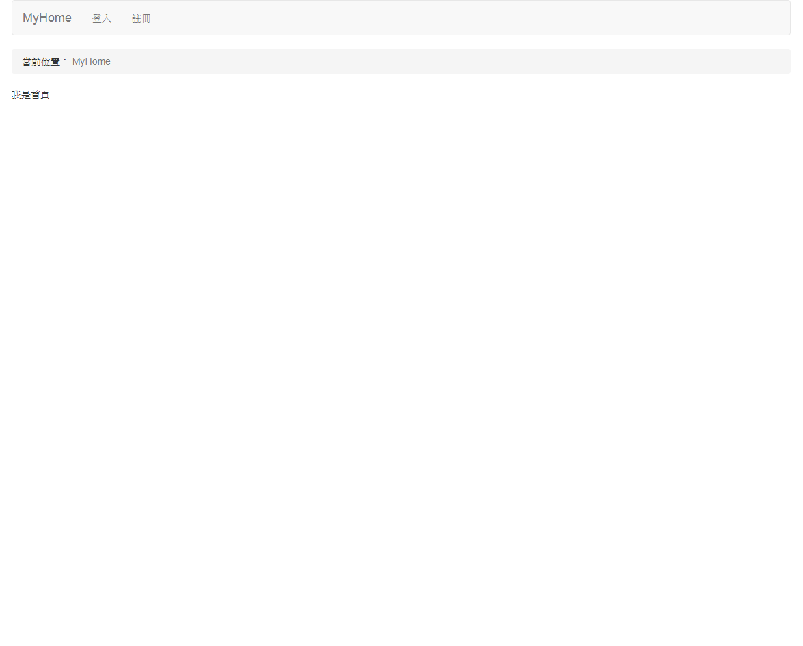
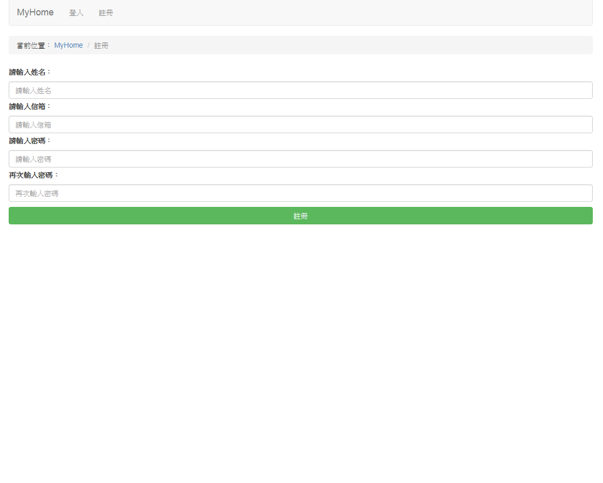
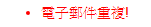
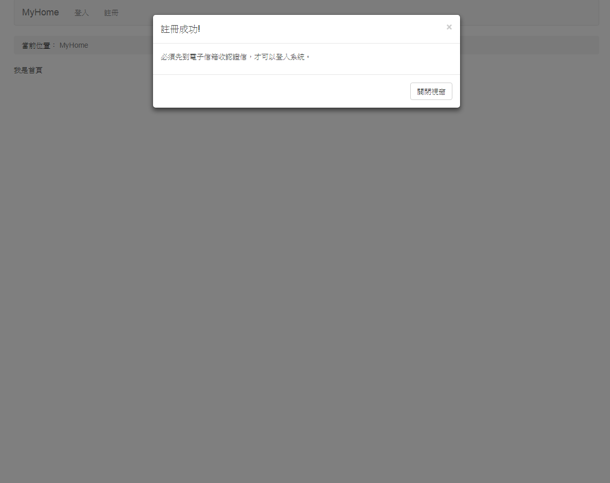
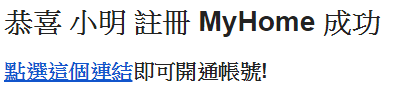
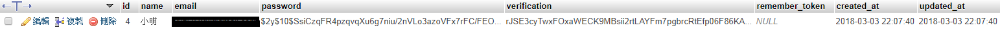
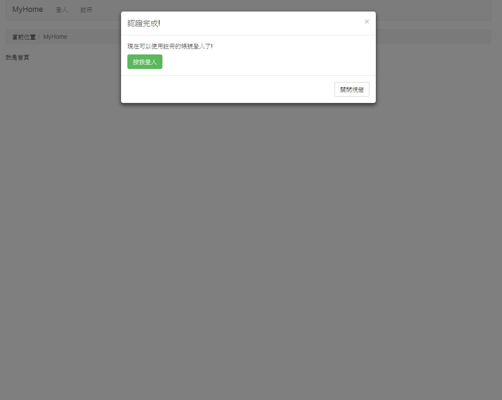

# Laravel 5.6.7 開發 註冊/登入 功能

# 執行方式:
* ### 安裝 redis，windows的有[微軟的版本](https://github.com/MicrosoftArchive/redis/releases)
* ### 在redis的目錄下執行`redis-server.exe redis.windows.conf`來執行redis，如果嫌要切目錄麻煩，可以把redis的路徑設定到環境變數
* ### 在專案目錄執行 `composer require "predis/predis"`
* ### 在專案目錄執行 `php artisan queue:listen`
* ### 在專案目錄執行 `php artisan serve`
* ### 在網址輸入 `localhost:8000`

# env的設定
### 可以直接把`.env.my.example`複製一份，(這一份是我使用gmail的設定，把一些不會變的設定先設定好了，例如redis或smtp等等設定)，複製後將檔名改為`.env`，之後下面是要設定的細項:
* ### 在專案目錄下執行 `php artisan key:generate`，設定一組隨機的APP_KEY。
* ### `DB_DATABASE=` 改為這個專案要使用的資料表名稱
* ### `DB_USERNAME=,DB_PASSWORD=` 帳號與密碼
* ### `MAIL_USERNAME=,MAIL_PASSWORD=`gmail的帳號與應用程式密碼，應用程式密碼取得的步驟:`google我的帳戶->登入和安全性->登入Google->應用程式密碼->選取郵件與Windows電腦->產生`

# 目前的首頁:

# 註冊頁面:

### 信箱在這個專案中必須是唯一的，如果不唯一則會出現，基本上驗證都有使用Valiator與Middleware做到。

### 按下註冊之後會寄信到所註冊的電子郵件，同時回首頁跳出提醒視窗:

### 而下圖是郵件內容:

### 而連結就是開通使用者，所以在註冊的時候每個使用者會有一組特定的key，為亂數產生的，存在register_users資料表中的verification欄位，如圖:

### 點下連結後會回到首頁，並跳出提示訊息，如圖:

### 在這同時register_users的會員資料會消失並被移動至users資料表中，之後做登入功能的時候就會到users取資料。

# 登入功能 待補....